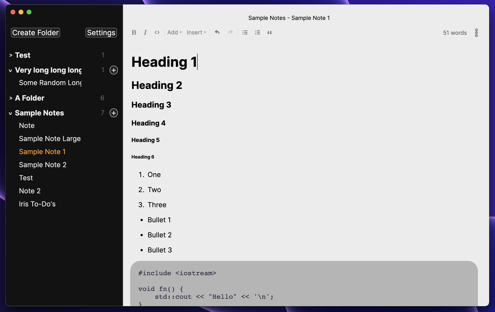
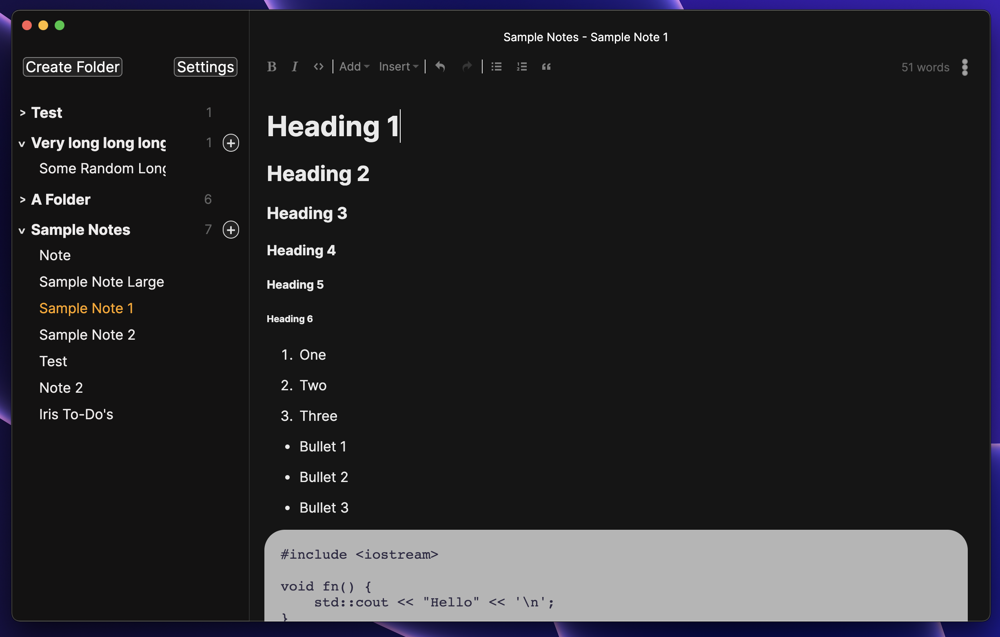

<h1 align="center">✨ Iris</h1>

<p align="center">Iris is a comfortable Markdown note-taking app. Written in TypeScript and Rust.</p>

</img>

</img>

<p align="center">Current dev screenshots (subject to change; frequently updated)</p>

# Release date 

There is no set release date for v0.2.0 at the moment.  

This release will mark the first official build for Iris, so I don't want to rush anything. There will be a few dev builds that users can install to get a feel of the application before release.

The product website will be added closer to the release date. For now, you can use the [GitHub Discussions](https://github.com/alexwkleung/Iris/discussions) for communication.

# Installation

You can install the latest dev builds from [releases](https://github.com/alexwkleung/Iris/releases).

If you want to build the app directly from source, follow the instructions in [Development](#development).
 
# Development 

Install [Rust](https://www.rust-lang.org/tools/install)

Clone the repository

```bash 
git clone <SSH/HTTPS URL>
```

Change directory 

```bash
cd <...>/Iris
```

Install npm dependencies

```bash
npm install 
```

Build native modules

```bash
# change directory to native module
cd fs-mod

# build native module for your platform
npm run build

# go back to previous directory (assuming Iris root)
cd -
```

Run development build

```bash
# via make 
make dev

# via npm
npm run dev
```
# v0.1.x

If you want to take a look at the v0.1.x prototype source code, you can go to the [v0.1.1 release](https://github.com/alexwkleung/Iris/releases/tag/v0.1.1). 

# License 

[MIT License.](https://github.com/alexwkleung/Iris/blob/main/LICENSE)