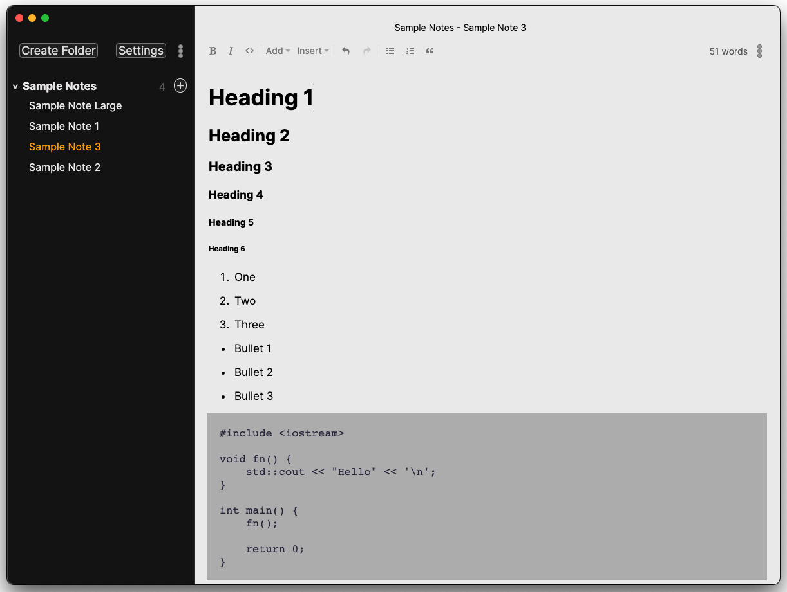
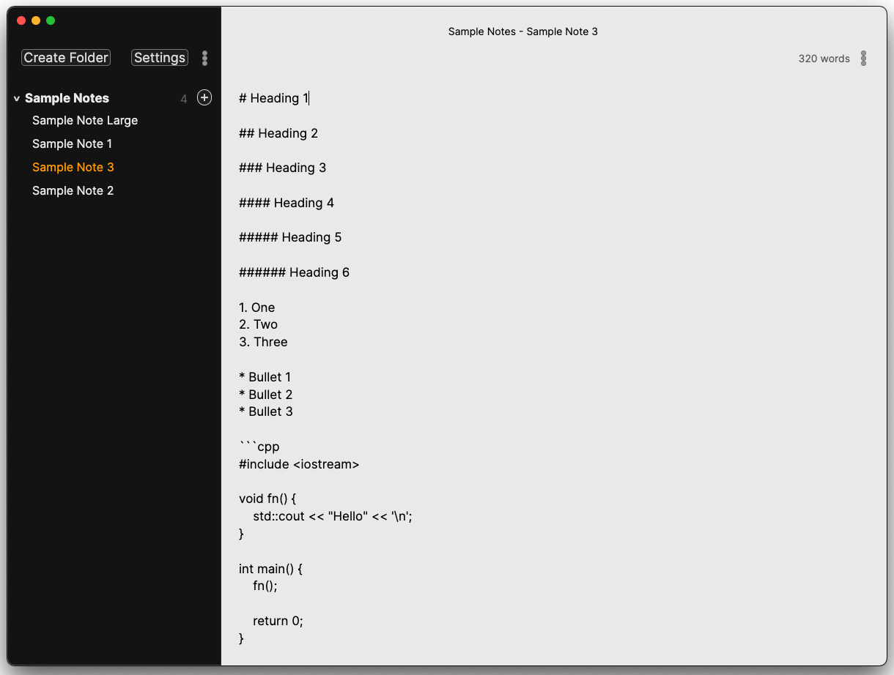
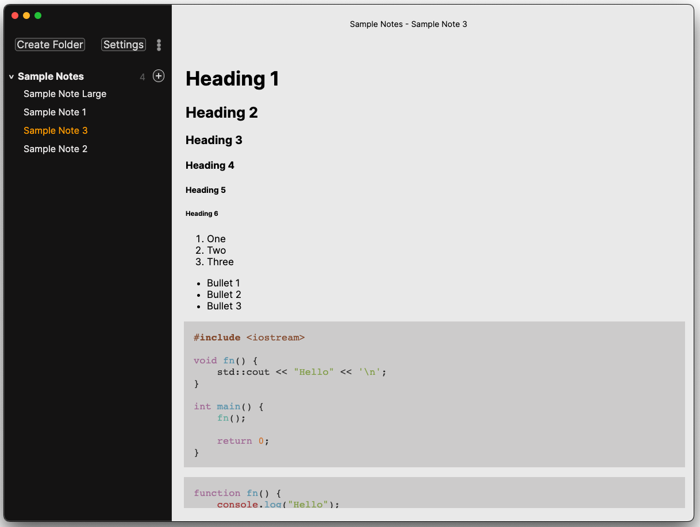

<h1 align="center" style="padding-top: 20px;padding-bottom:20px">
<a href="https://irisnotes.vercel.app">Iris <em style="font-size: 15px">(eye-riss)</em></a>
</h1>

<p align="center">
    A comfortable note-taking app powered by Markdown that introduces a elegant note-taking experience.
<br>
    Always local-first, open-source, and free forever.
</p>

<p align="center">
    </img>
    </img>
    </img>
</p>

</img>
</img>
</img>

# Info

Iris is written in TypeScript and Rust.

The app currently in early development and may not be 100% stable for daily use.

Only macOS installers are supplied in the early development phase. Other platforms will be supported in the official release.

v0.2.0 will mark the first official build for Iris. There will be a handful of dev builds that users can install to get a feel of the application before release.

You can use the [GitHub Discussions](https://github.com/alexwkleung/Iris/discussions) for communication. Other mediums will be created in the near future.

# Installation

At the moment, you can install the latest dev builds from [releases](https://github.com/alexwkleung/Iris/releases).

If you want to build the app directly from source, follow the instructions in [Development](#development).
 
# Development 

Install [Node.js](https://nodejs.org/en/download)

Install [Rust](https://www.rust-lang.org/tools/install)

If you are cross-compiling the native modules for other platforms (i.e., compile to MSVC on macOS), you'll need to install the corresponding target:

```bash
# check target list
rustc --print target-list

# install target
rustup target install <target>

# Apple Silicon:
rustup target install x86_64-apple-darwin

# Intel Architecture:
rustup target install aarch64-apple-darwin
```

The recommended build tool for Iris is [GNU Make](https://www.gnu.org/software/make/). All build steps or commands will be reflected in the `makefile`. At the moment, only a small set of commands have a `npm run` script counterpart.

```bash
# for example: install Xcode Command Line Tools on macOS (includes GNU Make)
xcode-select --install 
```

Clone the repository

```bash 
git clone <SSH/HTTPS URL>
```

Change directory 

```bash
cd <...>/Iris
```

Install npm dependencies

```bash
npm install 
```

Build native modules

```bash
# change directory to native module
cd fs-mod

# if you are planning to build a universal binary, you must have the native module for both x64 and arm64

# execute one of the build commands below:

# build native module for your platform (automatic)
npm run build
# build native module for macOS x64
npm run build-x64
# build native module for macOS arm64
npm run build-arm64

# go back to previous directory (assuming Iris root)
cd -
```

Run development server. The dev tools is undocked by default.

```bash
# via make 
make dev

# via npm
npm run dev
```

Build the installer 

```bash
# via make (x64)
make build-mac-x64

# via make (arm64)
make build-mac-arm64

# via make (universal)
make build-mac-universal

# via npm (x64)
npm run build:mac-x64

# via npm (universal)
npm run build:mac-universal

# via npm (arm64)
npm run build:mac-arm64

# windows and linux have not been tested yet
npm run build:win
npm run build:linux
```

# Contributing 

Here are a list of ways you can contribute to Iris:

1. [Submit a Pull Request](https://github.com/alexwkleung/Iris/pulls)
2. [Create or answer issues](https://github.com/alexwkleung/Iris/issues)
3. [Create or answer discussion posts](https://github.com/alexwkleung/Iris/discussions)
4. Show your interest by sharing Iris to others :)

# License 

[MIT License.](https://github.com/alexwkleung/Iris/blob/main/LICENSE)