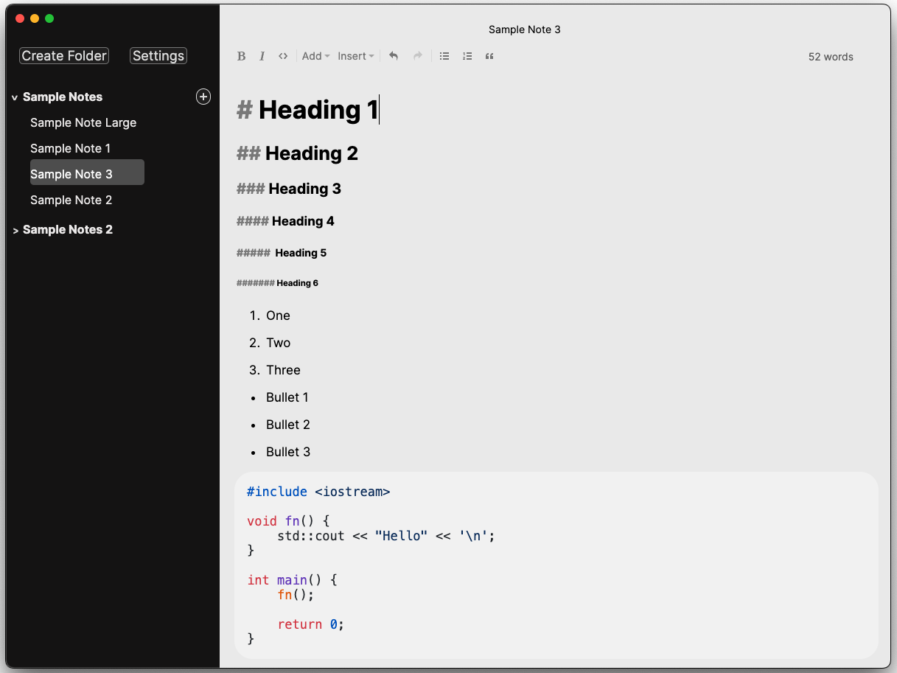

<h1 align="center" style="border-bottom: none">
<br>
<a href="https://irisnotes.vercel.app">Iris</a>
<br>
</h1>

<p align="center">
    <em>ˈaɪərɪs | eye-riss</em>
<br>
<br>
    A comfortable note-taking app powered by Markdown that introduces a elegant note-taking experience.
<br>
    Always local-first, open-source, and free forever.
</p>

<p align="center">
    </img>
    </img>
    </img>
</p>

<h4 align="center">
    <a href="https://discord.gg/z9QmRgJsmc" style="border-bottom: none">Discord</a>
</h4>

</img>
<p><i>Screenshot as of 2024-03-20</i></p>

# Info

The app is currently in early development and may not be 100% stable for daily use.

Only macOS installers will be supplied in the early development phase and official release (v1.0.0). Other platforms are not supported but may be considered in the future.

# Contact 

Join the [Discord](https://discord.gg/z9QmRgJsmc) to chat with others in the community.

For professional mediums, you can contact via email (expect 24-48 hour reply time): irisnotesapp@gmail.com 

[GitHub Discussions](https://github.com/alexwkleung/Iris/discussions) is also an alternative to the above contact methods.

# Installation

You can install the latest dev builds from [releases](https://github.com/alexwkleung/Iris/releases).

To build the app directly from source, follow the instructions in [Development](#development).
 
# Development (Tech Stack, Libraries, Tools)

**Tech Stack:**

1. TypeScript (Front-end)
2. Rust (Back-End)

**Libraries:**

1. Electron (Desktop framework)
2. napi-rs (Native Node modules using Rust)
3. ProseMirror (Note-taking editor)  
4. markdown-it (CommonMark flavoured Markdown)

**Tools:**

1. ESLint + Prettier (Code linter + code formatter)
2. Vite (Development server)
3. Vitest (Unit testing)
4. Make (Build tool)

# Development (Setup)

The recommended editor for development is [VS Code](https://code.visualstudio.com/)

Install [Node.js](https://nodejs.org/en/download)

Install [Rust](https://www.rust-lang.org/tools/install)

For cross-compiling the native modules, you'll need to install the corresponding target. This is necessary for universal builds (i.e., need to install x86_64 target on aarch64 machines).

```bash
# check target list
rustc --print target-list

# install target
rustup target install <target>

# For Apple Silicon:
rustup target install x86_64-apple-darwin

# For Intel:
rustup target install aarch64-apple-darwin
```

The recommended build tool for Iris is [GNU Make](https://www.gnu.org/software/make/). All build steps or commands will be reflected in the `makefile`.

```bash
# install Xcode Command Line Tools on macOS (includes GNU Make)
xcode-select --install 
```

Clone the repository

```bash 
git clone <SSH/HTTPS URL>
```

Change directory to project

```bash
cd <...>/Iris
```

Install npm dependencies. Only do this in the *root* of the project. Do not `npm install` inside of the native modules.

```bash
npm install 
```

It recommended to add these to your VS Code `settings.json`:

```json
"editor.codeActionsOnSave": {
    "source.fixAll.eslint": "always",
    "editor.formatOnSave": "always",
},
"prettier.enable": true,
```

Build native modules

You must have the native module for both x64 and arm64 in order to build the universal binary

```bash
# change directory to native module
cd fs-mod

# build native module for your platform (automatic)
npm run build

# build native module for macOS x64
npm run build-x64

# build native module for macOS arm64
npm run build-arm64

# go back to previous directory (assuming Iris root)
cd -
```

Run development server. The dev tools is undocked by default.

```bash
# via make 
make dev
```

Build the installer 

Universal is the recommended installer to build.

```bash
# via make (universal)
make build-mac-universal

# via make (x64)
make build-mac-x64

# via make (arm64)
make build-mac-arm64
```

# Contributing

Here are a list of ways you can contribute to Iris:

1. [Submit a pull request](https://github.com/alexwkleung/Iris/pulls)
2. [Create or answer issues](https://github.com/alexwkleung/Iris/issues)
3. [Create or answer discussion posts](https://github.com/alexwkleung/Iris/discussions)
4. Show your interest by sharing Iris to others :)

# License 

[MIT License.](https://github.com/alexwkleung/Iris/blob/main/LICENSE)