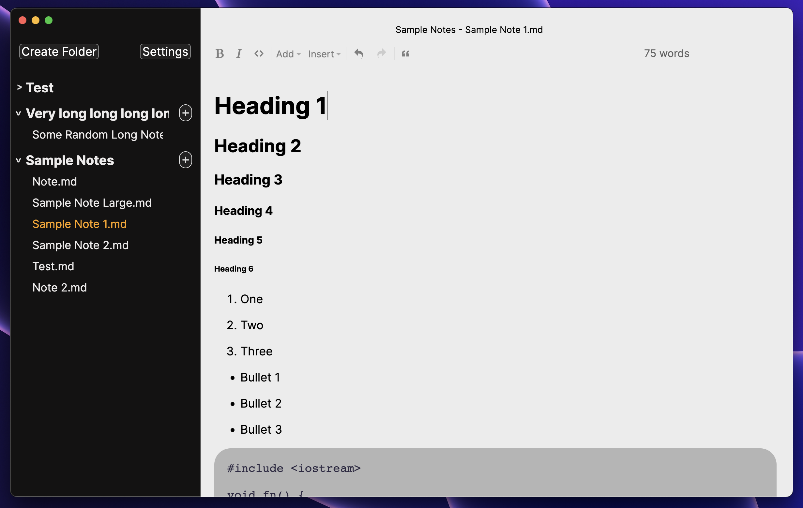

<h1 align="center">✨ Iris</h1>

<p align="center">Iris is a comfortable Markdown note-taking app. Created with TypeScript and Rust.</p>

</img>

<p align="center">Current dev screenshot (subject to change; frequently updated)</p>

# Release date 

There is no set release date for v0.2.0 at the moment.  

This release will mark the first official build for Iris, so I don't want to rush anything. There will be a few dev builds that users can install to get a feel of the application before release.

Iris is a long-term project on my free time, therefore development will take longer than expected. 

The product website will be added closer to the release date. For now, you can use the [GitHub Discussions](https://github.com/alexwkleung/Iris/discussions) for communication.

# Installation

For now, follow the instructions in [Development](#development) to try the current build of Iris.
 
# Development 

Install [Rust](https://www.rust-lang.org/tools/install)

Clone the repository

```bash 
git clone <SSH/HTTPS URL>
```

Change directory 

```bash
cd <...>/Iris
```

Install npm dependencies

```bash
npm install 
```

Run development build

```bash
# via make 
make dev

# via npm
npm run dev
```

At the moment, you will need to manually create the directory and files:

```bash
# home directory
cd ~ 

# create main directory
mkdir Iris

# create basic notes directory
mkdir Iris/Basic

# create a note
touch Iris/Basic/Note.md
```

# v0.1.x

If you want to take a look at the v0.1.x prototype source code, you can go to the [v0.1.1 release](https://github.com/alexwkleung/Iris/releases/tag/v0.1.1). 

# License 

[MIT License.](https://github.com/alexwkleung/Iris/blob/main/LICENSE)