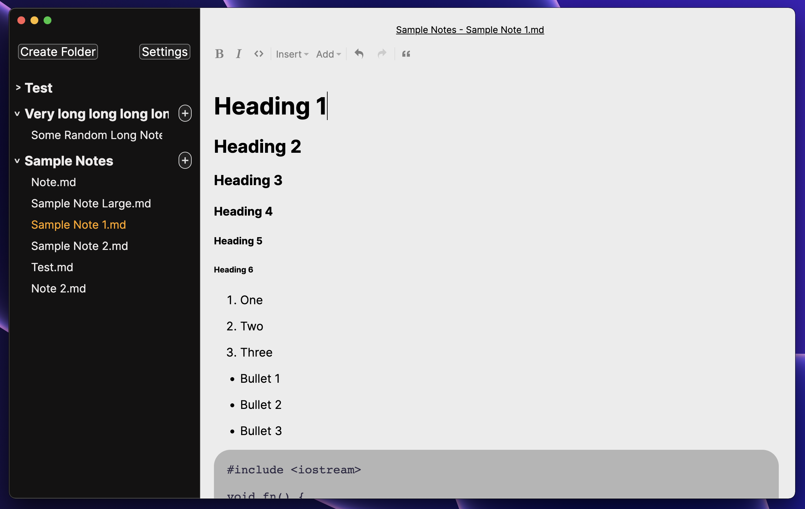

<h1 align="center">✨ Iris</h1>

<p align="center">Iris is a comfortable Markdown note-taking app. Created with TypeScript and Rust.</p>

</img>

<p align="center">Current dev screenshot (subject to change; frequently updated)</p>

# v0.2.0

v0.2.0 is currently in progress. For v0.1.x source code, [see here](https://github.com/alexwkleung/Iris/tree/main/v0.1.x).

# Installation

For now, follow the instructions in [Development](#development) to try the current build of Iris.
 
# Development 

Install [Rust](https://www.rust-lang.org/tools/install)

Clone the repository

```bash 
git clone <SSH/HTTPS URL>
```

Change directory 

```bash
cd <...>/Iris
```

Install npm dependencies

```bash
npm install 
```

Run development build

```bash
# via make 
make dev

# via npm
npm run dev
```

At the moment, you will need to manually create the directory and files:

```bash
# home directory
cd ~ 

# create main directory
mkdir Iris

# create basic notes directory
mkdir Iris/Basic

# create a note
touch Iris/Basic/Note.md
```

# License 

[MIT License.](https://github.com/alexwkleung/Iris/blob/main/LICENSE)